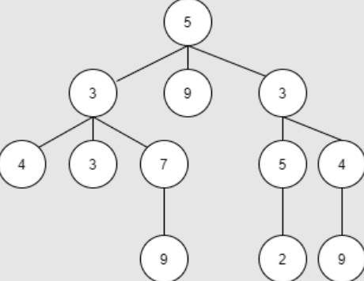
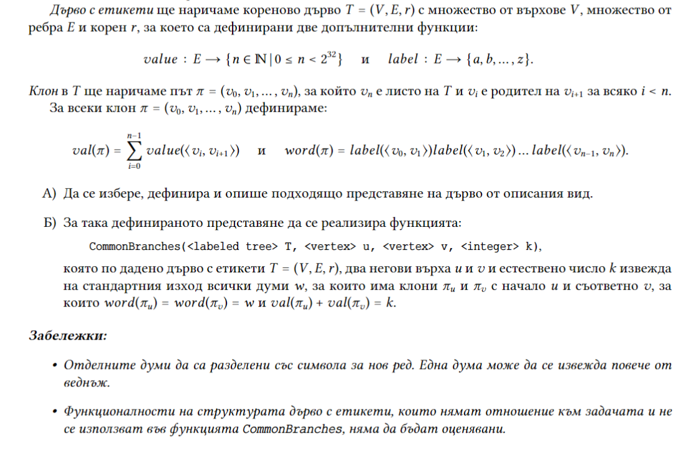
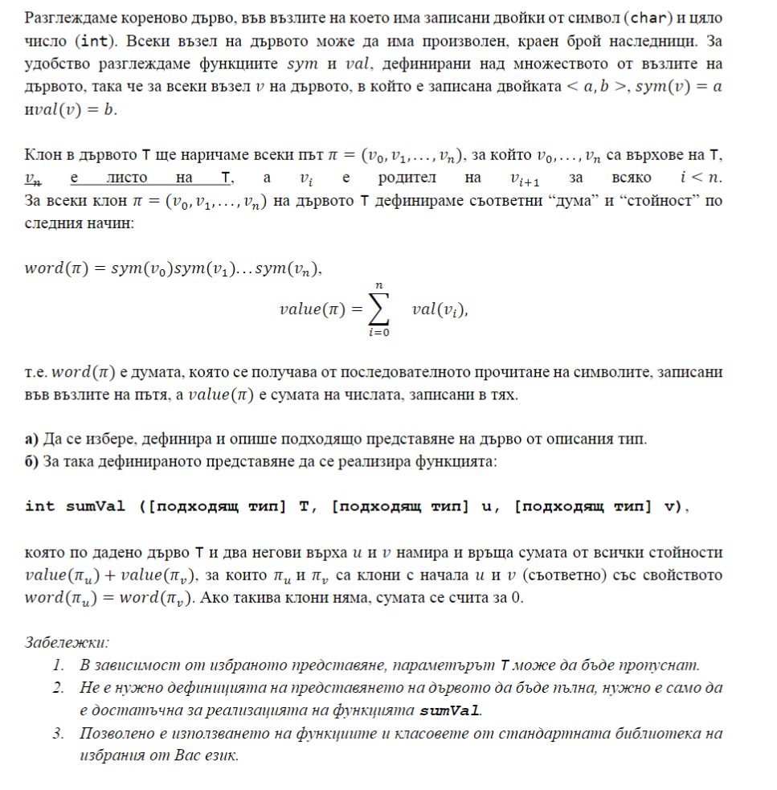

# Задачи върху дървета 2.


```c++

Node<int>* root = new Node<int>(50);
Node<int>* n1 = new Node<int>(25);
Node<int>* n2 = new Node<int>(75);
Node<int>* n3 = new Node<int>(12);
Node<int>* n4 = new Node<int>(30);
Node<int>* n5 = new Node<int>(60);
Node<int>* n6 = new Node<int>(85);
Node<int>* n7 = new Node<int>(52);
Node<int>* n8 = new Node<int>(70);

root->left = n1;
root->right = n2;
n1->left = n3;
n1->right = n4;
n2->left = n5;
n2->right = n6;
n5->left = n7;
n5->right = n8;
```



```c++
Node<int>* root = new Node<int>(5);
root->children.push_back(new Node<int>(3));
root->children.push_back(new Node<int>(9));
root->children.push_back(new Node<int>(3));

root->children[0]->children.push_back(new Node<int>(4));
root->children[0]->children.push_back(new Node<int>(3));
root->children[0]->children.push_back(new Node<int>(7));

root->children[0]->children[2]->children.push_back(new Node<int>(9));

root->children[2]->children.push_back(new Node<int>(5));
root->children[2]->children.push_back(new Node<int>(4));

root->children[2]->children[0]->children.push_back(new Node<int>(2));
root->children[2]->children[1]->children.push_back(new Node<int>(9));
```

## Задача 1 (Контролно) 
Ниво L на двоично дърво съдържа всички възли на дървото, които се намират на разстояние L от корена на дървото.  
(*Заб.:* приемаме, че коренът е на ниво 0, преките му наследници - на ниво 1 и т.н.).  
Да се напише функция, която приема като параметри указатели към корените на две двоични дървета от цели числа и *проверява дали е вярно, че елементите на всяко ниво L на едното дърво съвпадат с елементите на съответното ниво L на другото дърво*.

```c++
Node<int>* root1 = new Node<int>(1);
Node<int>* n1 = new Node<int>(2);
Node<int>* n2 = new Node<int>(3);
Node<int>* n3 = new Node<int>(4);
Node<int>* n4 = new Node<int>(5);
root1->left = n1;
root1->right = n2;
n2->left = n3;
n2->right = n4;

Node<int>* root2 = new Node<int>(1);
Node<int>* n11 = new Node<int>(3);
Node<int>* n22 = new Node<int>(2);
Node<int>* n33 = new Node<int>(5);
Node<int>* n44 = new Node<int>(4);
root2->left = n11;
root2->right = n22;
n22->left = n33;
n22->right = n44;
```

## Задача 2 (Контролно) 
Създайте (чрез включване) _**двоично наредено дърво от интервали от числа ([a, b], a <= b)**_.  
Наредбата в дървото да бъде по *средната стойност на интервала*.  
Намерете *максималния интервал от дървото* (спрямо описаната наредба в него), *чието сечение с всеки един от другите интервали е непразно*, или върнете [0, 0], ако такъв няма.  
Използвайте *наредеността* на дървото, където е удачно.  

```c++
Node<Interval>* root = new  Node<Interval>({ 8,12 });
Node<Interval>* n1 = new    Node<Interval>({ 6,10 }); // Replace with {6,8} and getMaxInterval(root) will return {8,12}
Node<Interval>* n2 = new    Node<Interval>({ 10,20 });
Node<Interval>* n3 = new    Node<Interval>({ 7,12 });
Node<Interval>* n4 = new    Node<Interval>({ 11,18 });
Node<Interval>* n5 = new    Node<Interval>({ 10,30 });
root->left = n1;
root->right = n2;
n1->right = n3;
n2->left = n4;
n2->right = n5;
```


## Задача 3 
Да се напише функция, която приема двоично дърво от естествени числа и връща *дали в дървото има път от листо до друго листо, "минаващ" през корена, само с четни числа*.  

## Задача 4
 Да се напише функция, която приема двоично дърво T и двоично дърво R и *проверява дали R е поддърво на T*.  

## Задача 5 (Контролно) 

Дадена е двоично дърво(дърво за търсене)
Да се напише функция, която по подаден указател към корен
на дърво определя дали съществуват две нива в дървото, за които е
изпълнено, че сумата от елементите на едното ниво съвпада със сумата от
елементите на другото ниво.
Приема се, че функцията ще работи за всички типове Т, за които операцията + e
предефинирана.

## Задача 6 
При даден корен на двоично дърво, върнете дължината на диаметъра на дървото.

Диаметърът на двоично дърво е дължината на най-дългия път между всеки два възела в дървото. Този път може или не може да минава през корена.

## Задача 7 (Държавен изпит)



## Задача 8 (Държавен изпит)



```c++

/*
        A
    B       B
    C       C       
*/

int main()
{
    Node n1({ 1, 'a' });
    Node n11({ 1, 'b' });
    Node n12({ 1, 'b' });
    Node n111({ 1, 'c' });
    Node n112({ 1, 'c' });
    Node n121({ 1, 'c' });
    Node n122({ 1, 'c' });
    n1.children.push_back(&n11);
    n1.children.push_back(&n12);
    n11.children.push_back(&n111);
    n12.children.push_back(&n121);
}

```